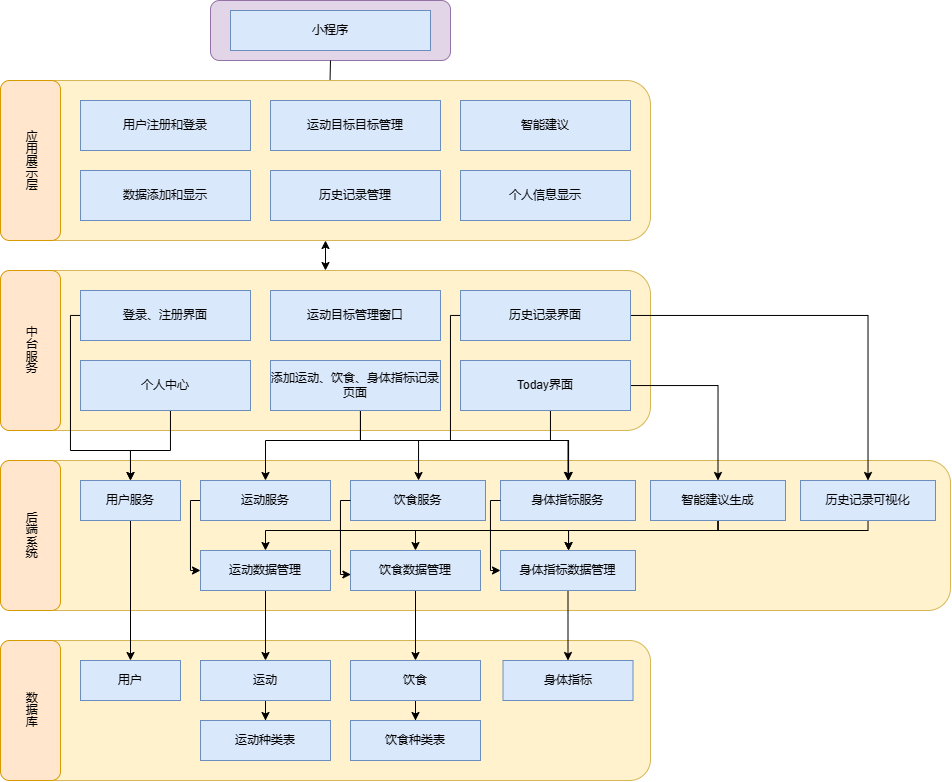
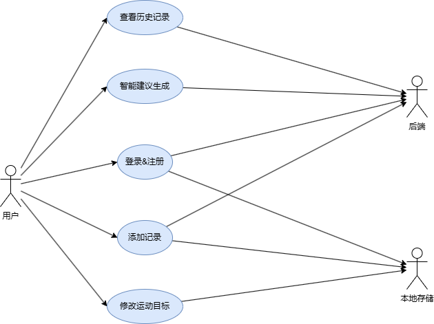
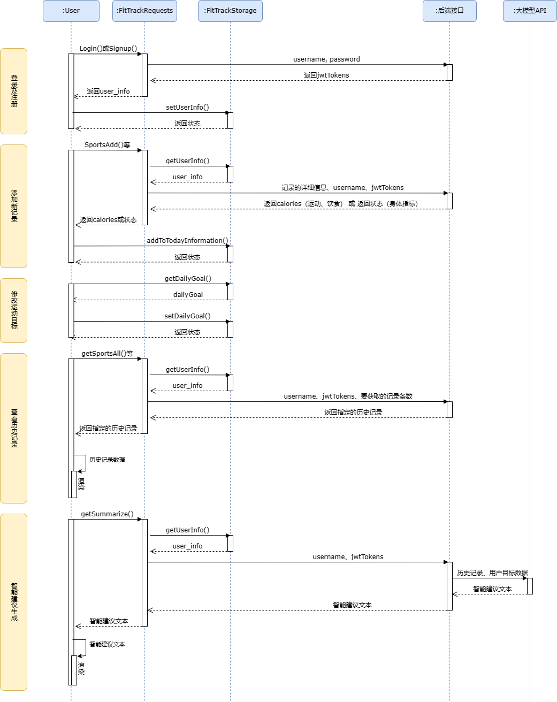

# 架构设计文档

## 一、引言

### 1.1 项目背景

在当今社会，随着人们生活节奏的加快和工作压力的增大，越来越多的人开始意识到身体健康的重要性。健身活动、合理饮食以及身体指标的监测，已成为许多人追求健康生活的关键要素。然而，传统的健身方式往往缺乏系统性、科学性和可持续性，难以有效帮助用户达到健身目标。因此，开发一款能够综合记录、分析和管理健身活动的应用显得尤为迫切。

### 1.2 项目概述

FitTrack 是一款综合健身跟踪应用，旨在帮助用户记录、分析和管理他们的健身活动、饮食习惯和身体指标，从而实现健康生活目标。用户可以个性化设置目标、跟踪进度，并获得个性化建议和报告。

## 二、总体设计

### 2.1 总体架构设计

FitTrack小程序采用分层架构和用户-服务器架构，在前端采用MVC架构处理用户交互和渲染。

#### 1. 应用展示层 (前端)

* **用户登陆注册**：提供用户登录和注册的功能界面，处理用户身份验证和账号创建。
* **运动目标管理**：允许用户设定、查看和修改每日或长期的运动目标。
* **智能建议**：基于用户的历史数据，展示个性化的健康、饮食和运动建议。
* **数据添加和显示**：提供界面让用户输入（添加）运动、饮食、身体指标等数据，并展示这些数据。
* **历史记录管理**：用户可以查看和管理自己的历史运动、饮食和身体指标记录。
* **个人信息显示**：展示用户的个人信息，如用户名、头像、基本资料等。

#### 2. 中台服务 (中间层/业务逻辑层)

* **登录注册界面**：处理前端发送的登录和注册请求，与后端系统交互以验证用户信息。
* **个人中心**：整合用户的个人信息、设置、反馈等功能。
* **运动目标管理窗口**：处理前端发送的运动目标设定、查看和修改请求，与后端系统交互。
* **添加运动饮食身体指标记录页面**：接收前端发送的新增记录请求，并转发给后端系统处理。
* **历史记录界面**：从后端系统获取历史记录数据，并展示给前端。
* **Today界面**：展示今天的运动、饮食和身体指标数据，以及相关的智能建议。

#### 3. 后端系统 (服务层/数据访问层)

* **用户服务**：负责用户账号的管理，包括验证、创建、更新用户信息等。
* **运动饮食身体指标服务**：处理与运动、饮食、身体指标相关的业务逻辑，如新增记录、获取历史记录等。
* **对应数据管理**：负责与数据库交互，执行数据的增删改查操作。
* **智能建议**：基于用户的历史数据，生成个性化的健康、饮食和运动建议。

#### 4. 数据库

* **用户运动饮食身体指标**：存储用户的运动、饮食、身体指标等历史数据。
* **运动种类表**：存储所有可用的运动种类信息，如跑步、游泳等。
* **饮食种类表**：存储所有可用的食物种类信息，如蔬菜、肉类等。

### 2.2 用例图

要描述包含这些功能的用例图，我们需要区分后端服务和本地存储的功能。以下是对这些功能的描述以及它们在用例图中的表示方式：

### 1. **用户查看历史记录**（后端）

* **用例名称**：查看历史记录
* **参与者**：用户
* **前置条件**：用户已登录
* **基本流**：
    1. 用户请求查看历史记录。
    2. 后端服务验证用户身份。
    3. 后端服务检索历史记录。
    4. 后端服务返回历史记录给前端。
    5. 前端显示历史记录给用户。

### 2. **智能建议生成**（后端）

* **用例名称**：智能建议生成
* **参与者**：系统（自动化）
* **前置条件**：系统收集到足够的数据（如用户历史记录）
* **基本流**：
    1. 系统分析用户数据（如历史记录）。
    2. 系统根据分析生成智能建议。
    3. 当用户请求时，后端服务提供智能建议给前端。
    4. 前端显示智能建议给用户。

### 3. **登录**（后端）

* **用例名称**：登录
* **参与者**：用户
* **前置条件**：用户有有效的账户
* **基本流**：
    1. 用户输入用户名和密码。
    2. 后端服务验证用户名和密码。
    3. 如果验证成功，后端服务生成会话令牌并返回给前端。
    4. 前端保存会话令牌并通知用户登录成功。

### 4. **注册**（后端）

* **用例名称**：注册
* **参与者**：用户
* **前置条件**：无
* **基本流**：
    1. 用户输入注册信息（如用户名、密码、邮箱等）。
    2. 后端服务验证注册信息（如检查用户名是否已存在）。
    3. 如果信息有效，后端服务创建新用户账户。
    4. 后端服务返回注册成功消息给前端。
    5. 前端通知用户注册成功。

### 5. **添加记录**（本地存储）

* **用例名称**：添加记录
* **参与者**：用户
* **前置条件**：用户已登录
* **基本流**：
    1. 用户输入新记录的信息（如运动类型、时间、消耗的卡路里等）。
    2. 前端将新记录信息保存到本地存储。
    3. 前端通知用户记录已保存。
    * **可选流**：用户选择将新记录同步到后端（如果支持）。

### 6. **修改运动目标**（本地存储）

* **用例名称**：修改运动目标
* **参与者**：用户
* **前置条件**：用户已登录
* **基本流**：
    1. 用户输入新的运动目标（如每日步数、消耗的卡路里等）。
    2. 前端将新的运动目标保存到本地存储。
    3. 前端通知用户目标已修改。
    * **可选流**：用户选择将新的运动目标同步到后端（如果支持）。

### 2.3 顺序图

## 三、模块设计

### 3.1 前端模块设计

**前端页面结构：**

前端的页面结构如下：

||页面|描述|子页面|
|-|-|-|-|
|1|login|登录页面。|-|
|2|signup|注册页面。|-|
|3|Today|展示今日运动状况、目标完成情况及智能建议；支持更改每日目标、添加运动、饮食、身体指标记录等。|add_sport,add_diet,add_body|
|4|历史记录|展示运动、饮食、身体指标的历史记录。|sportRecords,dietRecords,bodyRecords|
|5|个人中心|展示用户数据。|-|

页面描述

1. 登录页面 (login)

功能/用途：此页面用于用户登录应用。用户需要输入用户名和密码（或其他验证方式，如手机号验证码）以访问应用的其他功能。
交互方式：用户点击输入框，输入用户名和密码，然后点击登录按钮进行验证。如果验证成功，将跳转到应用的主页或用户上次访问的页面；如果验证失败，将显示错误信息提示用户重新输入。

2. 注册页面 (signup)

功能/用途：此页面用于新用户注册应用账号。用户需要提供必要的信息（如用户名、密码、邮箱、手机号等）以创建新账号。
交互方式：用户填写表单中的各项信息，点击注册按钮提交信息。如果信息填写完整且符合要求，将创建新账号并提示用户登录；如果信息填写有误或不完整，将显示错误信息提示用户修改。

3. 今日页面 (Today)

功能/用途：此页面用于展示用户今日的运动状况、目标完成情况及智能建议。同时，支持用户更改每日目标、添加运动、饮食、身体指标记录等。
交互方式：用户可以查看今日的各项数据和建议，点击相应按钮或链接进行目标修改、运动添加、饮食记录等操作。添加的数据将实时更新在页面上，方便用户随时查看和管理。

4. 历史记录页面

功能/用途：此页面用于展示用户运动、饮食、身体指标的历史记录。用户可以查看过去的数据记录，分析自己的健康状况和变化趋势。
交互方式：用户可以通过时间筛选器选择查看不同时间段的数据记录，点击具体条目查看详细信息。同时，支持数据导出和分享功能，方便用户与其他应用或服务进行交互。

5. 个人中心页面 (个人中心)

功能/用途：此页面用于展示用户的基本信息和数据概览。用户可以查看自己的账号信息、历史订单、积分等，并进行一些个性化设置。
交互方式：用户可以查看个人信息和数据概览，点击相关链接进行订单查看、积分兑换等操作。同时，支持修改密码、绑定手机号等安全设置功能，保障用户账号安全。

**工具类：**

前端创建了如下两个工具类，用于处理请求和本地存储相关任务。

FitTrackRequests 是一个专门用于处理与后端服务器通信的工具类。它封装了与后端API交互的逻辑，使得前端代码在需要发送请求或获取数据时，能够以一种统一和简洁的方式来进行。

FitTrackStorage 是一个专门用于处理本地存储（如浏览器localStorage或IndexedDB）的工具类。它封装了与本地存储交互的逻辑，使得前端代码在需要存储或读取本地数据时，能够以一种统一和简洁的方式来进行。

||工具类名|功能|主要方法|
|-|-|-|-|
|1|FitTrackRequests|处理与后端的请求相关任务。|SportAdd, DietAdd, BodyAdd, Login, Signup, getSportsAll, getDietAll, getBodyAll, getSummarize|
|2|FitTrackStorage|处理本地存储相关任务。|getUserInfo, setUserInfo, getTodayInformation, setTodayInformation, addToTodayInformation, getDailyGoal, setDailyGoal|

### 3.2 后端模块设计

# ##TODO##

## 四、接口设计

# ##TODO##
